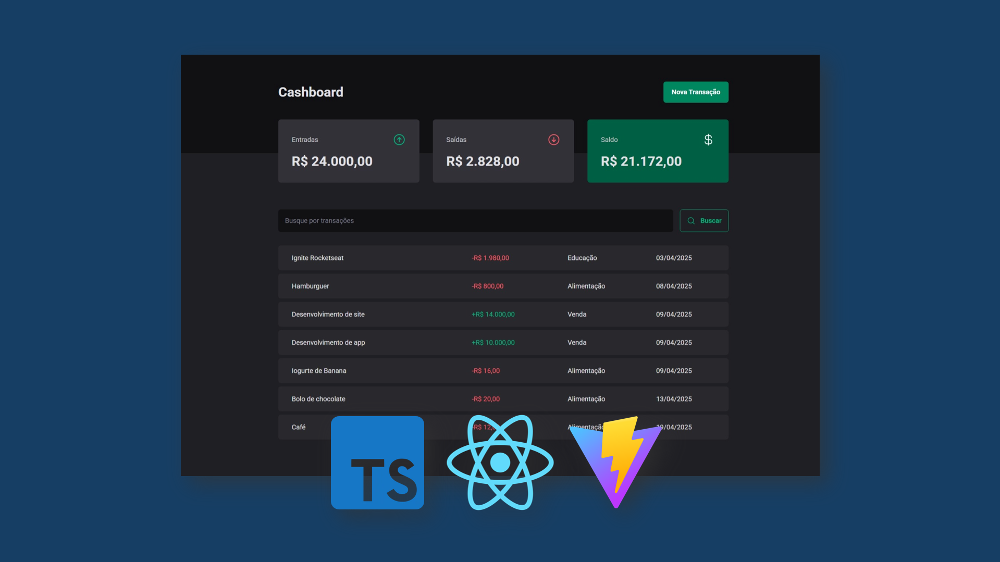

# Finances Dashboard (Single-Page Application)

Finances Dashboard is a single-page application (SPA) built as part of my studies at Rocketseat. It allows users to manage financial transactions by adding income and expenses with personalized details.

## Features
- Add income and expenses, categorizing each transaction.
- Track and organize financial entries efficiently.
- View transaction history for better financial management.
- JSON Server: Used as a mock API to store and retrieve financial data.
- Responsive design for a smooth experience across devices.

## Technologies Used
- React.js for building the front-end.
- TypeScript for strong typing and improved development experience.
- Vite for fast development and optimized build processes.
- Styled Components for modular and maintainable styling.
- json-server for simulating a back-end and handling data operations.

## Project Gallery

## My Journey
This project was developed as part of my studies at Rocketseat and helped me deepen my understanding of structuring financial data. Implementing json-server as a mock API made it easier to manage and retrieve transaction records efficiently. Working on this strengthened my ability to organize and handle financial information in a structured, user-friendly way.
